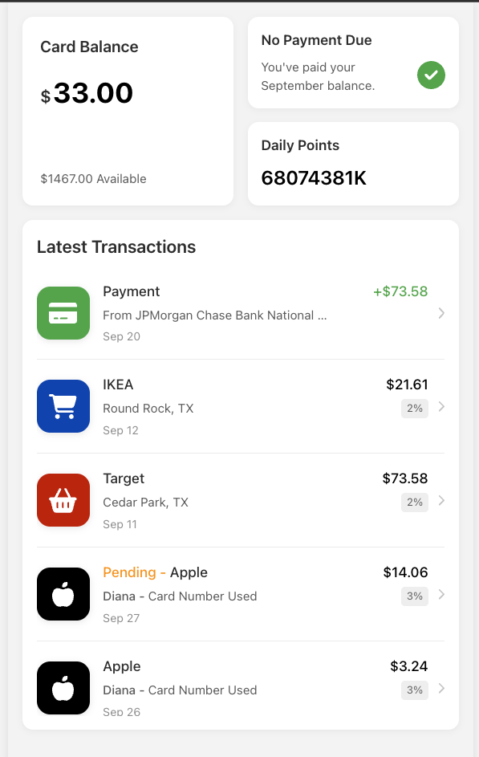
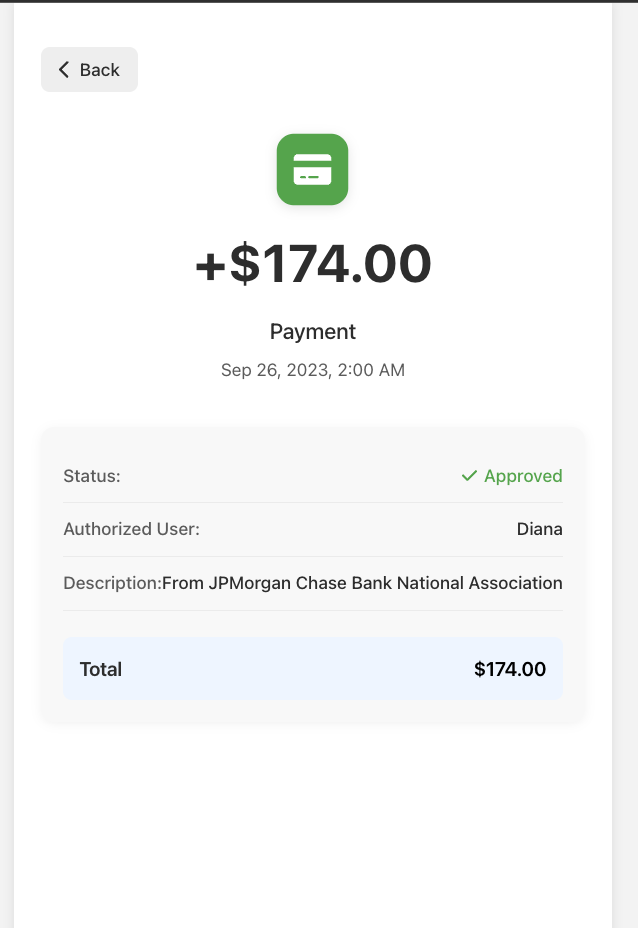

# Wallet App

A modern mobile wallet application built with React and TypeScript that allows users to view their card balance, transactions, and transaction details.

## Screenshots

### Transaction List


*Main screen showing card balance, payment status, daily points, and transaction history*

### Transaction Detail - Payment


*Detailed view of a payment transaction showing status, user, and amount information*

### Transaction Detail - Credit


*Detailed view of a credit transaction with merchant information and cashback percentage*

## Features

- View card balance and available credit
- See payment status with visual indicators
- Track daily points accumulation
- Browse transaction history with transaction details
- View detailed information for each transaction
- Mobile-first responsive design

## Technologies Used

- React.js with TypeScript
- React Router for navigation
- Font Awesome for icons
- CSS Modules for styling
- JSON for data storage

## Project Structure

The project follows a modular component-based architecture:

```
src/
├── components/            # UI components
│   ├── CardBalanceBlock   # Card balance display
│   ├── NoPaymentDueBlock  # Payment status
│   ├── DailyPointsBlock   # Daily points display
│   ├── TransactionsList   # List of transactions
│   ├── TransactionItem    # Individual transaction
│   ├── TransactionDetail  # Detailed view of transaction
│   └── CompanyLogo        # Company logos with brand colors
├── context/               # React context for state management
├── data/                  # JSON data for transactions
├── screens/               # Screen components for different pages
├── types/                 # TypeScript interfaces and types
└── utils/                 # Utility functions (points calculation)
```

## Key Features Implementation

### Card Balance

The app displays the current card balance, maximum limit, and available credit.

### Transactions List

Displays the latest 10 transactions with:
- Company logo with brand colors
- Transaction amount
- Transaction name and description
- Date formatted as day name for recent transactions
- Pending status indicators
- Authorized user information
- Cashback percentage where applicable

### Transaction Details

When clicking on a transaction, the app displays detailed information:
- Transaction amount and merchant
- Date and time
- Transaction status (Pending/Approved)
- Card information
- Authorized user (if applicable)
- Cashback percentage (if applicable)
- Complete description

### Daily Points Calculation

Points are calculated based on the following formula:
- First day of the season: 2 points
- Second day of the season: 3 points
- Subsequent days: 100% of points from day before previous + 60% of points from previous day
- Points exceeding 1000 are displayed in "K" format

## Getting Started

### Prerequisites

- Node.js (v14 or higher)
- npm or yarn

### Installation

1. Clone the repository:
```
git clone git@github.com:HeydarliAtabay/walletApp.git
cd walletApp
```

2. Install dependencies:
```
npm install
```

3. Start the development server:
```
npm run dev
```

4. Open your browser and navigate to:
```
http://localhost:5173
```

## Building for Production

To build the app for production, run:

```
npm run build
```

The built files will be in the `dist` directory.

## Future Improvements

- Add user authentication
- Implement transaction filtering
- Add transaction categories
- Include charts for spending analysis
- Support for multiple cards and accounts

## Acknowledgments

- Design inspired by modern banking apps
- Test data is for demonstration purposes only
